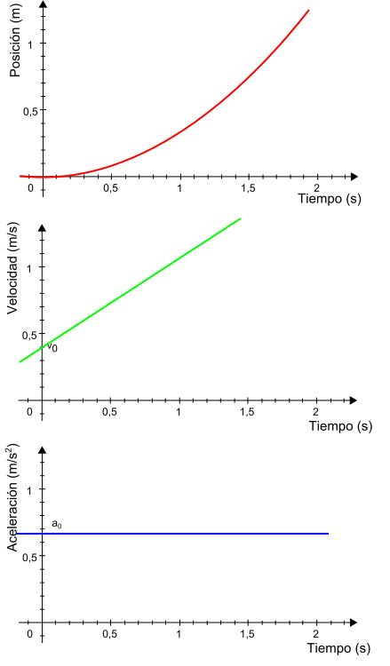

# Tug of War Math Game

## Concept

This project is designed with the goal of basing the gameplay on real-world physics. Inspired by the classic game "Tug of War," the aim was to create a fun and engaging experience.

### Why is the game like this?

Although there is no actual rope or people pulling it, the core idea remains: two players compete to pull the flag toward themselves. After analyzing other 1v1 games like **Super Smash Bros** and **Street Fighter**, where static elements are avoided to maintain dynamic gameplay, I decided that a visible rope would not add to the fun — it would be just a tense, unmoving line.

Thus, the players use "superpowers" to pull a floating flag. This allows for:
- More dynamic, fast-paced gameplay
- Independent application of forces to each side
- Opportunities to explore physics and math in an interactive way

Because the flag is not physically attached, the forces applied to it vary and create a richer gameplay experience!

---

## How to Run the Game

1. Download the repository.
2. Install Python (if not installed).
3. Run:
   ```bash
   python -m http.server 8000
   ```
4. Open your browser and navigate to:
   [http://localhost:8000/](http://localhost:8000/)

---

## How to Play

- Select the grade or area of mathematics by clicking the buttons.
- The game starts!
- Each round, two questions appear.
- Players answer the questions as fast as possible.
- First to answer correctly wins the round.
- A missed answer means you cannot answer again in that round.
- Winning a round earns "force points" to pull the flag closer.
- After each answer, spin the **Wheel of Fortune** to win power-ups:
  - **Nothing**: Nothing happens.
  - **Double**: Earn double force points.
  - **Extra**: Get an extra question for the chance to earn double points.
- Force points are visualized by the size of the players.
- When the flag reaches a player — **Victory!** 🎉
- A special animation celebrates the winner.

---

## Physics Explanation

### Forces

**Force**: A push or pull on an object resulting from interaction with another object.

- Formula: \( F = m \times a \)
  - \( F \): Force
  - \( m \): Mass
  - \( a \): Acceleration

**Key Points:**
- Force is a vector: it has both magnitude and direction.
- It’s measured in Newtons (N). In this game, we use "force points" (fp) as our unit.

**How it works in the game:**
- When the right player wins a point, the system gets +1 fp to the right.
- When the left player wins, the system gets -1 fp to the left.
- Net force: \( F = (\text{Right player's points}) - (\text{Left player's points}) \)

**Simplified movement:**
- Instead of true acceleration, the game applies direct velocity changes for smoother, more predictable gameplay.
- Thus, when no forces act, the object remains stationary.
- This simplification removes the complexity of momentum and inertia.



For deeper reading: [Speed, Velocity, and Acceleration](https://gradeelevenphysics.weebly.com/speed-velocity-and-acceleration.html)

### The Flag's Behavior

- The flag moves faster than the players.
- This can be interpreted as:
  - The flag experiences a greater force.
  - Or the flag has a smaller mass (thus more acceleration for the same force).
- In the game, mass differences are ignored: the flag simply receives greater force.

---

## Wheel of Fortune Physics

### Spinner Mechanics

The Wheel of Fortune simulates basic rotational physics:

- **Angular Velocity (ω)**: The speed at which the wheel spins.
- **Friction**: Every frame, the wheel's speed is reduced by a friction coefficient (default: 0.98).
- **Pointer**: A visual pointer oscillates slightly as the wheel spins to mimic real-world "click" sensations.

**Key Simulation Steps:**
1. When a spin starts, an initial random angular velocity is assigned.
2. Angular velocity decreases each frame due to friction: \( \omega = \omega \times \text{friction} \).
3. When \( \omega < 0.01 \), the wheel stops.
4. The final section where the pointer lands determines the reward.

**Pointer Behavior:**
- The pointer reacts when passing a section boundary.
- A small, quick rotation simulates the 'click' sound/feeling seen in real wheels.

This provides a very satisfying and realistic "spin and stop" feeling without involving complex real-world torque and energy loss equations.

---

## Areas for Improvement 🚀

- **Graphics Enhancements**: Add polished graphics for players, background animations, particle effects for victories, etc.
- **Deeper Physics Simulation**: Implement true acceleration, momentum, mass differentiation, and friction forces.
- **External API for Questions**: Connect to an API to fetch real-world math, science, history, or geography questions dynamically.
- **More Game Modes**:
  - Timed challenges
  - Physics-based puzzles
  - Cooperative modes
- **More Animations**:
  - Better "pull" animations showing force buildup.
  - Dynamic reactions when players answer correctly/incorrectly.
  - Small animations when the wheel spins and stops.
- **Sound Effects**: Add sounds for wheel spins, correct/incorrect answers, and victory celebrations.
- **UI Improvements**: Enhance feedback to players with better fonts, colors, and interactive buttons.

---

## Thank You!

I hope you enjoy this project and feel the real-world physics in action! 🚀🎮

